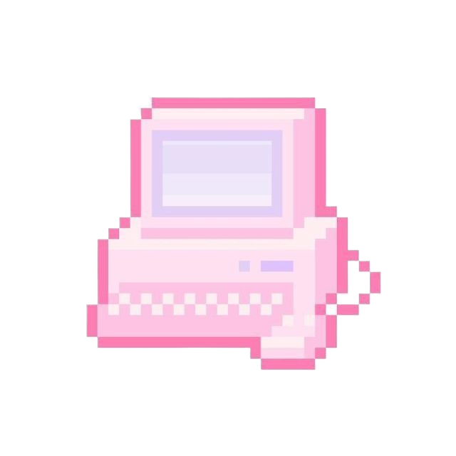

<h1 align="center"><i> Hi, I'm Jenny! </i></h1>

<!--<h3 align="center"><i>Career--</i></h3>-->

    :black_heart: <b>Software Engineer Intern @ </b><a href="https://github.com/StrikerVirtualRecoil"><b> StrikerVR</b></a> for Summer 2025 :black_heart: 
    <!-- University of New Orleans Alumna :blue_heart::white_heart:  -->
    :blue_heart::white_heart: University of New Orleans Alumna 
<!--

<h3 align="center"><i>Personal life--</i></h3>

-->
    :zap::battery: Powered by the small details
<!--  Lover of video games, fitness, stationery, and cats-->

<h3 align="center"><a href="http://jenspi.github.io"><i>Check out my portfolio...  ˶ᵔ ᵕ ᵔ˶ </i></h3></a>

<!-- Skills -->
<!--

    

      <h3 align="center">Skills</h3>
    

      

        <a href="https://skillicons.dev">
          
<strong>Front End:</strong>

            
          
<strong>Back End & Frameworks:</strong>

            
          
<strong>Collaboration:</strong>

            
          
<strong>Game Development:</strong>

            
          
<strong>Miscellaneous:</strong>

            
        </a>
      

-->

