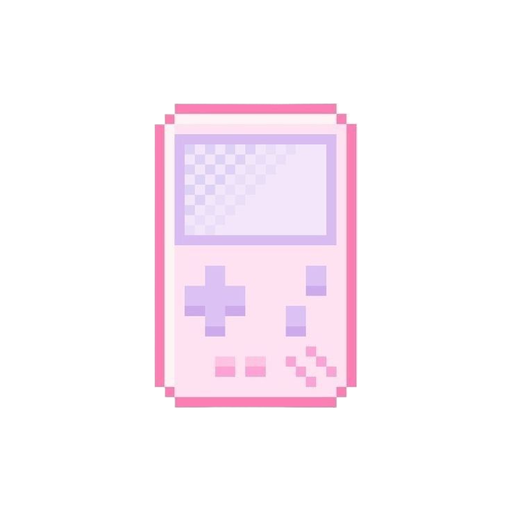

<h1 align="center"><i>Hi, I'm Jenny! </i></h1>

>*Practice doesn't make you perfect, but it does make you better.*

### [_Look @ my portfolio :)_](http://jenspi.github.io)

### _Personal life--_

    Enjoyer of <strong>organizing</strong> and <strong>making things pretty</strong>

 <strong>Favorites</strong>: fitness, video games, acrylic markers, cats, and reading non-fiction

### _Academic life--_

     University of New Orleans undergrad -> ??? graduate school

  <strong>Tolmas Scholar '25</strong> researching under Dr. Christopher Summa

  <strong>Undergraduate Researcher</strong> under Dr. Shreya Banerjee

<!-- Skills -->

    

      <h3 align="center">Skills</h3>
    

      

        <a href="https://skillicons.dev">
          
<strong>Front End:</strong>

            
          
<strong>Back End & Frameworks:</strong>

            
          
<strong>Collaboration:</strong>

            
          
<strong>Game Development:</strong>

            
          
<strong>Miscellaneous:</strong>

            
        </a>
      

<!-- Streak -->
<!--
  

    
<h3>Github Stats</h3>

  

  

  -->

<!-- Contact -->
<h2 align="left">Contact Me</h2>

  <!-- LinkedIn -->
   
  
  <!-- UNO email -->
   
