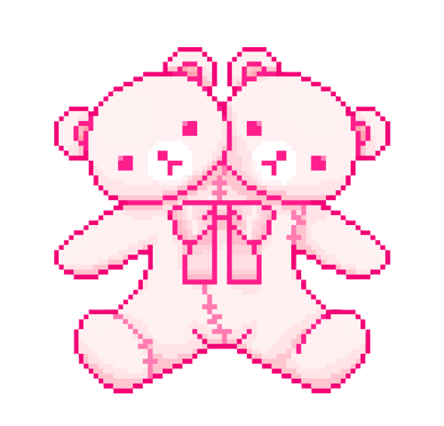

<h1 align="center"><i>Hi, I'm Jenny! </i></h1>

>*Practice doesn't make you perfect, but it does make you better.*

### _Personal life_

    <strong>I love making things pretty ♥ᴥ♥</strong>

 <strong>Favorites</strong>: fitness, video games, acrylic markers, cats, and reading nonfiction :)

### _Academic life_

   <strong>Undergraduate student</strong> at University of New Orleans, graduating May 2025... then, onto Grad school :)

  <strong>Tolmas scholar</strong> researching *???* with data visualization in Spring 2025 (under Dr. Christopher Summa)

  Conducting <strong>additional research</strong> on increasing EQ in children through gamification (under Dr. Shreya Banerjee) -- won <strong>Startup UNO</strong> 2024!

 

### [_Portfolio_](http://jenspi.github.io)

<!-- Skills -->
<h2 align="center"><i>My Skills</i></h2>

  <a href="https://skillicons.dev">
    
<strong><i>Front End:</i></strong>

      
    
<strong><i>Back End & Frameworks:</i></strong>

      
    
<strong><i>Collaboration:</i></strong>

      
    
<strong><i>Game Development:</i></strong>

      
    
<strong><i>Miscellaneous:</i></strong>

      
  </a>

 

<!-- Streak -->
  

    
<h2><i> Github Stats 💗</i></h2>

  

  

<!-- Contact -->
<h2 align="left"><i>Contact Me</i></h2>

  <!-- LinkedIn -->
   
  
  <!-- UNO email -->
   
